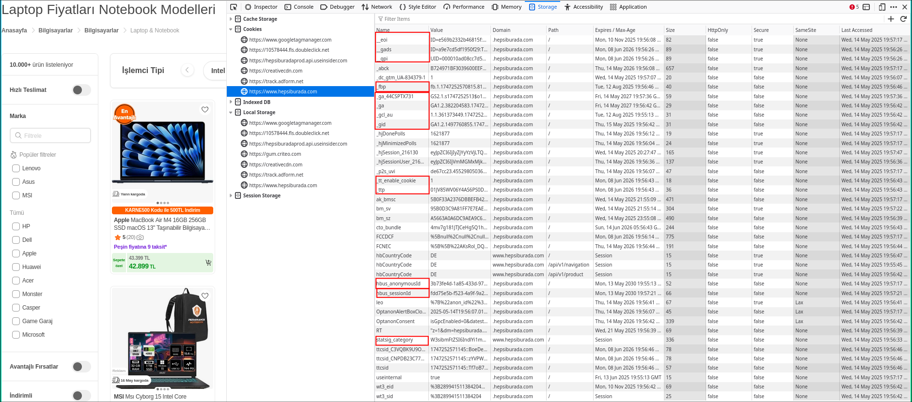
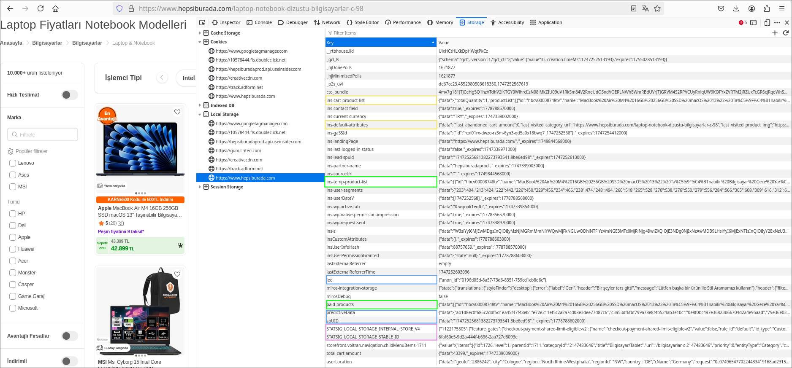

# Diceus Automation Challenge

This project covers the full automation task described in the Diceus QA challenge. It includes UI tests, API tests, and test analysis tasks. The repository is structured using the Page Object Model and supports running tests in Chrome and Firefox.

---

## 1. Pencil Testing Task

When testing a pencil with an eraser on one end, you can check it in different ways depending on the type of testing:

* **Functional** — does the pencil write, does the eraser work, and how well?
* **Usability** — is it comfortable to hold, does it slip, is it easy to write for a long time, is the eraser easy to use?
* **Performance** — how much can you write before the pencil gets too short, how long does the eraser last, how many times can it erase?
* **Load / Stress** — what happens if you press hard or drop it on the floor, does it break or crack?
* **Security** — is it safe for kids: no sharp edges, no small parts, no harmful materials?
* **Edge cases** — writing with a wet pencil, leaving it in direct sunlight, sharpening it too often, etc.

---

## 2. Product Recommendations on Hepsiburada

Product recommendations appear in several locations on [hepsiburada.com](https://www.hepsiburada.com):

* **Main page** – usually popular or promotional items.
* **Product pages** – related or complementary products (e.g., a case for a phone).
* **Cart page** – items that are often bought together.

These recommendations are not random. They are based on what the user has viewed, searched for, or added to the cart. This information is stored using browser **cookies** and **localStorage**, helping to build a user profile and show more relevant products.

Some products may also be promoted via paid placements.

The goal is to increase conversions by suggesting relevant or complementary items.

### 2.1 Cookies Involved in Recommendations



The following cookies are responsible for tracking users, analyzing behavior, and generating personalized suggestions:

| Cookie Name                     | Purpose                                                          |
| ------------------------------- | ---------------------------------------------------------------- |
| `_eoi`                          | Unique user ID used internally for analytics and personalization |
| `_gads`, `_gpi`                 | Google Ads tracking and remarketing                              |
| `_ga`, `_gid`, `_ga_4S4CPTX731` | Google Analytics — user interaction data                         |
| `_gcl_au`                       | Google Conversion Linker for measuring ad performance            |
| `_fbp`                          | Facebook Pixel ID for tracking conversions and retargeting       |
| `_ttp`, `_tt_enable_cookie`     | TikTok Pixel tracking for behavior analysis                      |
| `cto_bundle`                    | Criteo cookie for delivering personalized product ads            |
| `hbus_anonymousId`              | Anonymous user identifier used for personalized recommendations  |
| `userinternal`                  | Indicates whether the user is internal or logged-in              |
| `OptanonConsent`                | Stores user consent preferences for tracking                     |
| `statSig_category`              | Used for A/B testing different versions of recommendation blocks |

These cookies are used by third-party analytics and advertising services (Google, Criteo, Facebook, TikTok), and are essential for retargeting, behavior-based filtering, and personalized recommendations.

### 2.2 Local Storage Entries Related to Recommendations



In the above screenshot, different groups of localStorage keys are marked using colored boxes. Here's what each group means:

* **Yellow boxes**: Contextual recommendation logic. These keys store product and category details like `ins-cart-product-list`, `ins-default-attributes`, and related metadata.
* **Green boxes**: Recently viewed products. Keys like `ins-temp-product-list` and `paid-products` reflect what the user recently interacted with.
* **Blue boxes**: Anonymous or session-based personalization. Keys such as `leo` or `spUID` provide anonymous user IDs to track behavior across sessions.
* **Purple boxes**: A/B testing and feature flag data. Keys like `STATSIG_LOCAL_STORAGE_INTERNAL_STORE_V4` contain experiment participation info.

These localStorage entries are crucial for determining which products to show and tailoring the recommendation engine on the client side.

---

## 3. UI Tests — useinsider.com

UI automation scenario using **Python + raw Selenium**:

* Page Object Model (POM) structure
* Supports **Chrome** and **Firefox** via CLI
* Captures **screenshots** on failure

> JavaScript was used in places where scrolling was required, instead of `ActionChains()`, for full compatibility between Chrome and Firefox.

Wrapper frameworks like [Selene](https://github.com/yashaka/selene) or alternatives such as Playwright can also be used.

---

## 4. API Tests — Swagger Petstore

CRUD tests using the public API: [https://petstore.swagger.io/v2/pet](https://petstore.swagger.io/v2/pet)

### Tested Scenarios:

* ✅ Create a new pet (positive)
* 🔍 Get a pet by ID (positive and negative)
* ✏️ Update a pet (positive)
* ❌ Delete a pet (positive and non-existent ID)
* 🚫 Create with invalid body (negative)

Tests are written in **Python** using `requests` and `pytest`.

---

# 🔧 Test Automation Project Setup

## Installation

```bash
  pip install -r requirements.txt
```

## Running Tests

### Run All Tests

```bash
  pytest
```

### Run UI Tests Only

```bash
  pytest -m ui
```

### Run API Tests Only

```bash
  pytest -m api
```

### Run Negative Tests

```bash
  pytest -m negative
```

### Combine Markers

AND:

```bash
  pytest -m "api and negative"
```

OR:

```bash
  pytest -m "api or ui"
```

---

## 🌐 Browser Configuration

### Chrome

```bash
  pytest --browser=chrome
```

### Firefox

```bash
  pytest --browser=firefox
```

### Headless Mode (default: true)

```bash
  pytest --browser=chrome --headless=true
```

Disable headless mode:

```bash
  pytest --browser=chrome --headless=false
```

---

## 📄 HTML Report

```bash
  pytest --html=report.html --self-contained-html
```

---

## 📦 JUnit XML (for CI/CD)

```bash
  pytest --junitxml=results.xml
```
